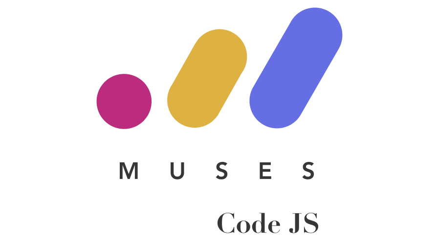

# Muses Code JS Mentor Manual



This manual is a set of useful tips and tricks that Muses Code JS mentors can use and reference.

Mentoring is an amazing skill for professional development and a fantastic way to give back to the community.

Being a mentor is a challenging but rewarding task and thus we have collected together all the things we have learned during the workshops so far to share with you.

If you notice any issues or have any suggestions for additions to the manual, please open a pull request.

## To run locally

Install Ruby dependencies:

```
bundle install
```

Then, run the below command to serve the website locally on http://127.0.0.1:4000/:

```
bundle exec jekyll serve
```
